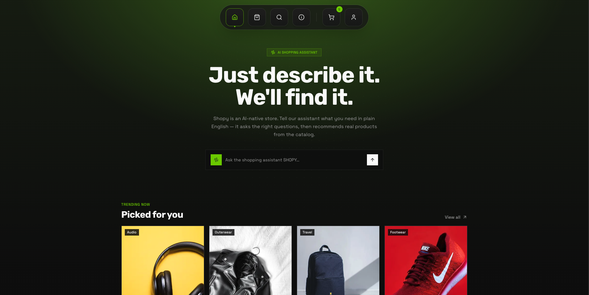

# Shopy — Shop at the speed of thought

AI-powered e-commerce frontend. Describe what you want in plain English, and Shopy finds it.


Open (https://shopy-seoul.vercel.app/)

---

## Stack

- **Next.js 16** (App Router)
- **React 19**
- **Tailwind CSS v4**
- **shadcn/ui** + Radix UI primitives
- **Framer Motion** for animations
- **next-themes** for dark/light mode
- **HugeIcons** icon set

## Features

- **AI Shopping Assistant** — natural-language search with intent detection and grounded product recommendations
- **Product Catalog** — browsable product listing with individual product pages
- **Cart & Checkout** — persistent cart state with a full checkout flow
- **Auth** — login and registration with JWT-based session handling
- **Account** — order history and account management
- **Dock Navigation** — floating nav with theme toggle
- **Dark / Light Mode** — system-aware with manual override

## Getting Started

### Prerequisites

- Node.js 20+
- A running instance of the Shopy backend API

### Install

```bash
npm install
```

### Configure environment

Create a `.env.local` file in the project root:

```env
NEXT_PUBLIC_API_BASE_URL=http://localhost:4000
```

The app validates this at startup — it will throw if the variable is missing or malformed.

### Run

```bash
npm run dev
```

Open [http://localhost:3000](http://localhost:3000).

## Scripts

| Command         | Description              |
| --------------- | ------------------------ |
| `npm run dev`   | Start development server |
| `npm run build` | Production build         |
| `npm run start` | Start production server  |
| `npm run lint`  | Run ESLint               |

## Project Structure

```
app/
  layout.tsx          # Root layout — providers, fonts, dock nav
  page.tsx            # Landing page
  products/           # Product listing + [id] detail page
  cart/               # Cart page
  checkout/           # Checkout flow
  account/            # Account & orders
  login/ register/    # Auth pages
  search/             # Search results
  about/              # About page

components/
  ai/                 # AI search view, result cards, intent chips, shopping assistant
  auth/               # Auth shell and forms
  landing/            # Landing page sections
  products/           # Product cards and lists
  cart/ checkout/     # Cart and checkout UI
  account/            # Account UI
  ui/                 # shadcn/ui base components
  dock-nav.tsx        # Floating dock navigation
  theme-provider.tsx  # next-themes wrapper

lib/
  env.ts              # Zod-validated environment config
  auth/               # Auth context and helpers
  cart/               # Cart context and helpers
  api/                # API client modules
  utils.ts            # Shared utilities
```
